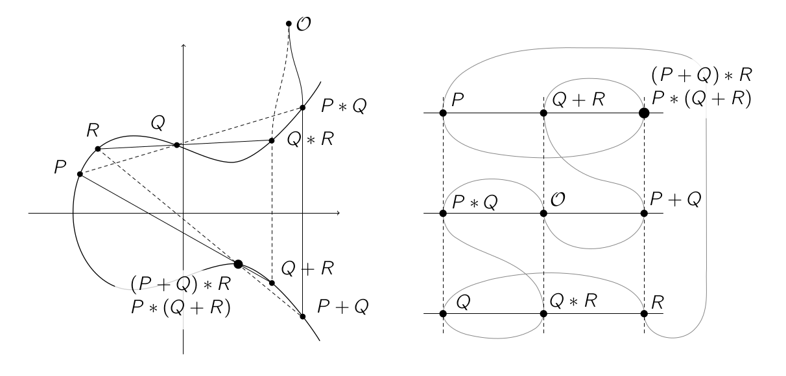
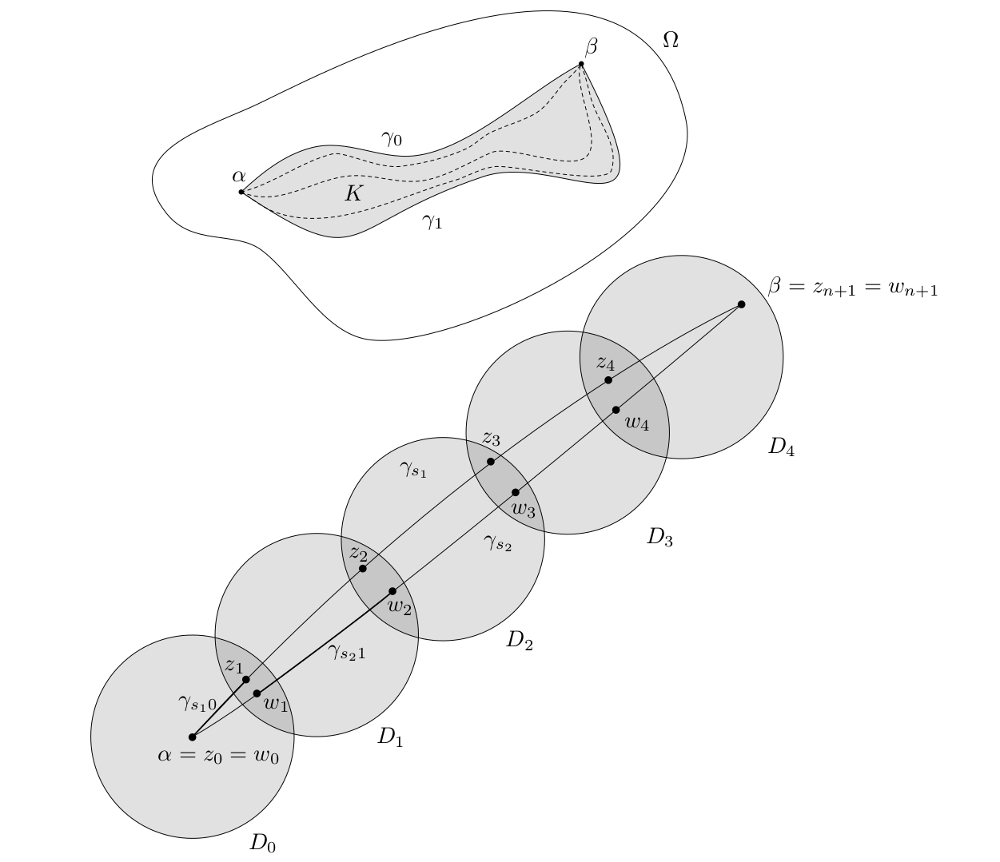

# Inkscape shortcut manager

*A shortcut manager that speeds up drawing (mathematical) figures in [Inkscape](https://inkscape.org/).*

## Problem

[I write my lecture notes in LaTeX](https://castel.dev/post/lecture-notes-1) and I want to draw figures in real time, i.e. while the lecturer is drawing on the blackboard. While the figures I want to draw quite simple, drawing them in Inkscape with default shortcuts takes too much time to keep up with a fast paced lecture. My goal is to draw figures like this:

## Solution

I created a custom shortcut manager that intercepts all keyboard events sent to Inkscape windows giving me full control of user input. The script has the following features 

- **Press clusters of keys (key chords) to apply common styles.** Pressing <kbd>d</kbd>+<kbd>a</kbd> gives a **d**otted **a**rrow, <kbd>f</kbd>+<kbd>s</kbd> **f**ills the selection in gray and adds a **s**troke. You want a circle that's **d**otted and **f**illed? Press <kbd>f</kbd> + <kbd>d</kbd>. Try pressing combinations of <kbd>s</kbd>, <kbd>a</kbd>, <kbd>d</kbd>, <kbd>g</kbd>, <kbd>h</kbd>, <kbd>x</kbd>, <kbd>e</kbd>, <kbd>b</kbd>, <kbd>f</kbd>, <kbd>w</kbd>. Being able to combine these common styles by pressing key chords feels quite intuitive after a while.
- **Save custom styles and objects.** Press <kbd>Shift+S</kbd> or <kbd>Shift+A</kbd> to give a style or object a name. Use it by pressing <kbd>s</kbd> or <kbd>a</kbd> and typing the name. For common styles that aren't covered by the key chords, this comes in handy.
- **Use your editor to write LaTeX.** Pressing <kbd>t</kbd> opens an instance of vim (or any editor you want). Write some LaTeX, close it, and the shortcut manager pastes the text in the figure. Pressing <kbd>Shift+T</kbd> does the same but renders the LaTeX as an svg and adds it to the document.
- **Ergonomic shortcuts for frequently used functions**. Press <kbd>w</kbd> for pencil, <kbd>x</kbd> to toggle snapping, <kbd>f</kbd> for Bézier, <kbd>z</kbd> to undo, <kbd>Shift</kbd>+<kbd>z</kbd> to delete and <kbd>\`</kbd> to dis/enable the shortcut manager.

For more details and context, feel free to read my [blog post](https://castel.dev/post/lecture-notes-2).

## Installing

Note that this script only works on GNU/Linux using Python ≥ 3.6.
It also has the following dependencies:

- `Xlib` python library to intercept keyboard events
- `pdflatex` and `pdf2svg` to render LaTeX in Inkscape
- `xclip` to access the clipboard
- `rofi` for a selection dialog when saving styles and objects

Use the shortcut manager by running `python3 main.py` and opening an Inkscape window.

## Configuration

You can configure the shortcut manager by creating a file located at `~/.config/inkscape-shortcut-manager/config.py`. You can override the rofi theme, font, editor, as well as the LaTeX template that's being used. It's merged with the default config located at `config.py`. An example configuration file is located in the `examples` directory.

## Related

* [Inkscape figure manager](https://github.com/gillescastel/inkscape-figures)
